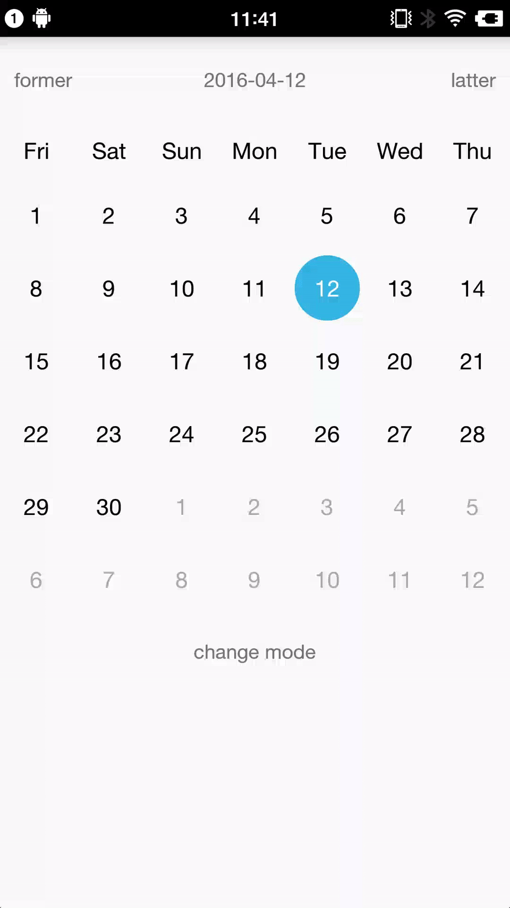

#Screenshots

#CalendarView
As the CalendarView projects in GitHub seem to be not so much **customizable**,this CalendarView was born and here is what i achieve.
- basically,`WeekView` (the title)  background color  customizable, `DayView` text   background color customizable
- what exactly important is, DayView **click**  customizable by implementing [DayClickListener](https://github.com/CallMeXYZ/CalendarView/blob/master/library/src/main/java/com/callmexyz/calendarview/dayclicklistener/DayClickListener.java) and calling  `setDayClickListener`. 

  both `onDayClick(DayView view, Calendar c, boolean ifRestoring)` and `onDayUnClick(DayView view, Calendar c)` hold the instance of the specific dayview, so u can custom whatever click effect u want.
  
  [CircleColor](https://github.com/CallMeXYZ/CalendarView/blob/master/library/src/main/java/com/callmexyz/calendarview/dayclicklistener/CircleColor.java) is a commen click effect as a exmple.So we won't worried about the same issue of circle size and padding when using most calendar view libraries.
  
  Since that `DayView` is extended from `RelativeLayout`, u can add any view u like to `DayView`
- both month mode or week mode are introduced 

# logs 
## 2015.4.5
- fix Utils.getWeekDiff. Why Java Calendar seems so powerless when it comes to calculate difference!Maybe u can take a coffee time to look at [joda-time-android](https://github.com/dlew/joda-time-android) if u don't want to be f***ed up.Lol

## 2015.4.1
- happy Fool's Day!Now the CalendarView can make u money per-millis! if u believe me...
- out-of-month day click event
- 6 week size per MonthView
- add MonthViewStyle now u can choose month mode or week mode both in layout or code;

## 2015.3.31
- rewrite the onDayUnClick mechanism 
- use RelativeLayout instead of TextView as the container of DayView,so that u can add whatever effect u want to the DayView;
- initiate `mCurrentPosition` in `CalendarView`
- restore work 
- select day by code

# Issues
## 2016.4.5
- ~~switch to week mode,sometimes it cannot navigate to the selected Calendar and unclick seems to be blocked until slide out the 3 limit page of PagerAdapter;~~ *2016.4.6*
  ~~override the `getItemPosition` method and return `POSITION_NONE` to force refresh in `MonthPagerAdapter`~~
  recreate `mMonthPagerAdapter` to avoid navigating slide during changing Calendar week mode

## 2016.4.1
- ~~week mode crash?what f!~~ *2016.4.5* deprecate Utils.ifSameWeek,return fake result in CalendarView. Calendar.setFirstDayOfWeek() seems weird

## 2016.3.31
- ~~out-of-month day click event~~ *2016.4.1*
- month collapse to WeekView
- when month view was added to a scrollable view,listen to the scroll state and can smooth collapse to weekview
- ~~Just call me FISH!!! I thought 5 week would be the MonthView size. How could I be so stupid on earth！~~ *2016.4.1*

## 2016.3.24
- ~~when click,size get smaller~~ *2016.3.31*
    ~~because `setBackGround(null)`,may be when set background drawable slide will cause resize~~
    true reason is CalenderView's padding.I used to set the height of TitleView and MonthItem is times of & and the surplus divided to CalenderView's left padding and right padding.Now remove this idea.
    
- ~~store day select state~~ *2016.3.24*
    the cache page is only 3 ,so the stored selected DayView in CalendarView is most likely not the same instance after slide back!!!
